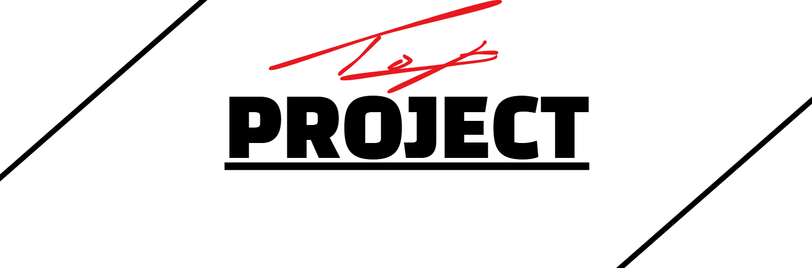

# 🖥️TOP (토이 프로젝트 모집 사이트)

📆 1차 제작 기간 : 2025.01 ~ 2025.05

📆 디자인 개선 및 기능 추가 : 2025.06 ~ 2025.07

😶 제작자 : 윤진욱 (Shouting Crow) </br>

😊 디자인 조언 : 배성욱

🕸️ 웹 페이지 : http://top-project.site/ (08:00 ~ 22:00 시간만 오픈)

<br></br>

# 🧩 프로젝트 소개  

<div align="center">  </div> <br>
개발자를 위한 협업 플랫폼, TOP
혼자만의 프로젝트에서 벗어나 다른 사람들과 함께 팀을 이루고
실제 개발 프로젝트를 함께 완성해 나갈 수 있는 웹 기반 플랫폼입니다.

<br>

🧑‍💻 이런 분들께 추천해요

-혼자 사이드 프로젝트를 하기 막막한 개발자 지망생

-협업 경험을 쌓고 싶은 비전공자

-사이드 프로젝트 멤버를 찾고 싶은 프리랜서 개발자

-프로젝트까지는 부담스럽지만, 스터디 그룹으로 학습하고 싶은 사람

<br>

🌐 지금 바로 여러분의 아이디어와 열정을 펼쳐보세요!
TOP에서 함께할 팀을 만나고, 여러분만의 프로젝트를 완성해보세요.

<br></br>

# 🔍 주요 기능

### 프로젝트 및 스터디그룹 모집 공고
* 누구나 모집 공고 등록이 가능
* 누구나 공고를 확인하고 원하는 공고에 지원 가능
* 공고 등록자는 지원자의 정보를 확인하고 승인/거부를 하여 그룹을 꾸릴 수 있음
### 쪽지 기능
* 공고 등록자나 다른 사용자에게 쪽지를 보낼 수 있음
* 최근 다섯 개의 쪽지를 확인할 수 있는 메뉴를 제공
* 쪽지함에서 확인 및 쪽지 삭제가 가능
### 그룹 생성 및 관리
* 공고 등록자는 공고를 마감하고 그룹을 생성할 수 있음
* 그룹원들은 자신들의 그룹 페이지에서 원하는 활동이 가능함
* 그룹 페이지에서 일정을 등록해서 공유할 수 있음
### 채팅 기능
* 그룹 관리자는 자신의 그룹의 채팅방을 생성할 수 있음
* 채팅방은 실시간 통신이 가능하도록 설계
### 게시판
* 누구나 게시글을 등록할 수 있음
* 게시글의 댓글을 이용할 수 있음
### 회원가입 및 로그인
* JWT 기능을 이용한 로그인 유지로 안정성을 올림
* 아이디나 비밀번호를 잊었을 경우 이메일 인증을 통해 해결이 가능

<br></br>

# 🔧 개발 환경

#### 🛠️ 백엔드
- ⚙️ Java, Spring Boot, Gradle
- 🗄️ MySQL, JPA, QueryDSL
- 🔐 Spring Security, JWT
- 🔌 WebSocket

#### 💻 프론트엔드
- ⚛️ React, JavaScript
- 🎨 TailwindCSS, HTML

#### ⚙️ 배포
- 🐋 Docker
- ☁ AWS

<br></br>

# 📝 다이어그램


<br></br>

# 📁 파일 구조

```
├─ backend
│  ├─ java
│  │  └─ com
│  │      └─ project
│  │          └─ top
│  │              ├─ batch
│  │              ├─ config
│  │              ├─ controller
│  │              ├─ domain
│  │              ├─ dto
│  │              ├─ filter
│  │              ├─ initializer
│  │              ├─ interceptor
│  │              ├─ repository
│  │              ├─ security
│  │              ├─ service
│  │              ├─ util
│  │              └─ verification
│  └─ resources
│      └─ static
│          └─ js
│
└─ frontend
   ├─ assets
   ├─ components
   ├─ context
   └─ pages
```

<br></br>

# 🔧 개선 사항
모든 개선 사항은 계속 진행 되고 있으며 완료된 작업에는 줄을 표시함.

~~1. 프로젝트 아이콘을 추가하고 Vite + React 대신 타이틀을 추가한다~~

~~2. 홈페이지 접속 (비로그인)~~
- 콘솔에 문제 없음
- 웹 어플리케이션에 대한 소개를 더 자세하고 깔끔하게 해 둘 필요가 있음 → 뷰 개선에서 자세히

~~3. 홈페이지 접속 (로그인)~~
- 콘솔의 로그에 최근 쪽지 요청 확인 로그와 쪽지 데이터 리스트를 가져오는 로그가 존재 → 삭제 필요
- 최근쪽지함은 디자인이 조금 되어 있는데 채팅방은 단순함
- 최근쪽지함에 데이터 배치를 조금 더 개선할 필요 있음

~~4. 프로젝트 모집 공고~~
- 검색 기능 및 상세 페이지로 이동은 잘 이루어짐
- 페이지네이션 버튼이 어느 정도의 공고들을 담는 div 하위에 존재하도록 변경 필요
- 디자인은 충분히 깔끔하고 좋다고 생각함

~~5. 공고 등록~~
- 창 모드를 할 때 헤더에 의해 프로젝트 모집 공고 등록이라는 글자가 가려짐 (전체 div의 상단 마진을 둠)
- 설명 부분에는 영문자가 기본 입력으로 되어 있는데 한글로 변경할 수 있다면 변경해보자
- 마감일이 오늘 기준으로 이전 이라면 오류가 발생하는데 “공고 등록을 실패했습니다” 문구 보다는 보다 상세한 경고 문구를 제공한다
- 혹여 에러가 나온다면 경고 창으로만 제공을 하고 콘솔에는 뜨지 않도록 변경한다 (개발용과 운영용을 따로 지정)

~~6. 공고 상세~~
- 디자인이 상당히 단순하다 → 뷰 개선에서 자세히
- 등록 시간이 현 시간과 9시간이 차이나는 듯 하다 → RDS의 MySQL 서버 시간 설정 고려
- 자동 마감이 되는지 확인이 필요하다 (날짜 종료시 00:00에 일괄 마감)

~~7. 쪽지 보내기~~
- 디자인도 적당하고 동작도 정상이지만, 버튼의 형태나 시스템 유저에는 쪽지를 보낼 수 없도록 개선이 필요

~~8. 공고 수정 및 삭제~~
-  올바르게 동작을 하여 문제될 것은 없지만 디자인 개선이 필요

~~9. 로그인~~
- 전혀 문제가 없지만 디자인이 조금 무미건조한 느낌이 있다. 일단 그대로 사용한다

~~10. 로그아웃~~
- 로그아웃을 했을 때는 무조건 홈페이지로 이동하도록 강제한다
- 로그아웃을 했는데도 다른 페이지에서 이전의 헤더가 그대로 나오는 경우를 해결한다

~~11. 공고 지원~~
- 지원 정보가 등록되지 않은 것도 잘 검출하고 지원도 올바르게 동작한다
- 지원자가 다 찼음에도 지원을 할 수 있는데 안내 문구라도 띄워줄 것(지원자 수를 늘려서 승인이 될 수 있기 때문에 오류는 아님)
- 지원한 공고가 없다면 지원한 공고가 없습니다라는 문구가 뜨도록 해두면 좋을 듯 하다

~~12. 내 공고~~
- 내 공고에서 공고 상세로 이동하고 돌아가기를 눌렀을 때 내 공고로 돌아가지 않음
- 내가 등록한 공고가 존재하지 않다면 등록한 공고가 없습니다와 같은 문구가 있는 페이지를 나타냄

~~13. 지원 정보~~
- 문제 없이 동작을 하지만 디자인 개선은 필요할 듯 하다

~~14. 공고 마감과 그룹 생성~~
- 전혀 문제는 없지만 모달 창의 디자인을 개선한다

~~15. 그룹 페이지~~
- 그룹 페이지는 사실상 기능이 미완성이라 여러가지 기능을 추가하고 관리할 수 있도록 제공할 필요가 있음
- 그룹 인원 관리 (추방 및 초대)는 잘 동작하고 채팅방 생성도 올바르게 동작
- 채팅방이 없을 때 채팅방을 누르면 나오는 에러 로그를 삭제

~~16. 채팅방~~
- 채팅방을 만들면 자동으로 채팅방이 열리는데 이 채팅방을 종료하면 채팅방 생성 모달이 떠있음
채팅방 생성을 통해 채팅방을 열 때는 이전의 모달은 제거하도록 함
- 적절한 위치에 창이 뜰 수 있도록 조정

~~17. 스터디그룹 모집 공고~~
- 역시나 마감일이 올바르지 않다면 에러 로그가 나오는데 이것을 없애고 알림 메시지를 개선한다

~~18. 스터디그룹 공고 상세~~
- 디자인 개선이 필수적이다

~~19. 내 그룹 페이지~~
- 디자인 개선이 필요하다
- 또한 동적 변화에 대한 버튼이나 글 박스의 크기가 잘 조정되어야 한다
- 수정 및 삭제와 탈퇴 동작은 잘 되고 있음
- 혹시 그룹이 없다면 가입된 그룹이 없습니다와 같은 문구가 있는 페이지를 보여주도록 한다

~~20. 내 지원 현황 페이지~~
- 몇몇의 페이지들을 통합해서 내 정보 페이지로 축약

21. 게시글 작성 페이지
- 문제는 없으나 디자인이 조금 더 개선되어야 한다
- 또한 사진과 같은 정보도 올릴 수 있게 기능을 확장해야 한다 (미구현)

~~22. 게시글 상세 페이지~~
- 역시나 디자인 개선이 반드시 필요하다
- 조회수, 댓글 및 대댓글, 댓글 수정 및 삭제 모두 잘 동작한다

~~23. 쪽지~~
- [시스템] 쪽지에는 답장을 하지 못하도록 막아야 한다
- 역시나 화면 크기에 따라 잘리거나 버튼의 형태가 변화하는 것을 수정한다
- 최근 쪽지를 눌러서 쪽지함 바로가기를 누르면 자동으로 접히도록 만든다

~~24. 내 정보 페이지~~
- 수정할 것은 디자인을 개선하고 몇몇 공통된 페이지들을 이 내 정보 페이지에 몰아서 표시

### 이후 방향
- HTTPS 도입으로 보안에 관련된 기능을 향상시키고 네트워크 보안에 대한 학습을 진행한다
- CI/CD 적용을 하고 백엔드나 데이터베이스 서버의 로그 모니터링 도구를 이용해서 관리 및 감지한다
- 단순 호스팅에서 확장하여 ECS를 도입해 관리할 수 있도록 학습 및 적용한다

# 🧾 기록 자료
프로젝트 1일차 부터의 기록 :  https://www.notion.so/1-17471ce0947680a48e55c22274828d6c?pvs=4
